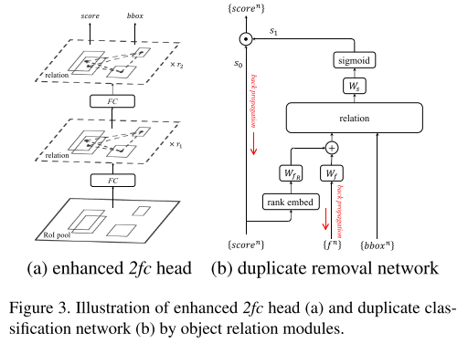
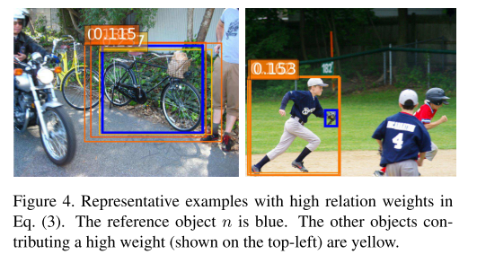

# Relation Networks for Object Detection

## 0. Summary

在目标检测网络中使用自注意力机制构建目标间的关系，包括语义关系及几何关系。几何关系的引入及对NMS操作的取代都基于目标间的关系，思路清晰。但是设计的关系模块能够取得效果缺乏解释性，更多是通过实验效果证明。

## 1. Research Objective

在目标检测中引入注意力机制，利用目标间的关系，协助进行目标检测。

## 2. Background and Problems

+ 目标间的关系一直被认为能够协助进行目标检测，在深度学习盛行之前，许多工作利用目标间关系，如同时出现的概率、位置及大小等协助进行目标检测。
+ 已有的深度学习方法对不同目标分别进行预测，没有考虑目标间关系。
  + 一方面是目标关系建模的困难，目标可能是任意数量、尺寸且出现在图像的任意位置。
  + 没有工作发现传统方法中使用的目标关系建模方法在深度学习同样有效，可能在卷积网络中通过大感受野提取的上下文信息隐式包含了传统方法中使用的关系信息。
+ 深度方法中会生成许多冗余结果，NMS是常用的去冗余操作，可以视为利用proposals间的关系进行计算的（proposals间的IoU及分类得分），因此可以利用关系建模取代NMS操作。
+ ***Problem***：使用注意力机制对不同目标间的关系进行建模，目标相比单词更加的复杂，有2D空间上的尺度、长宽比等区别，需要针对目标的几何信息优化自注意力机制。

## 3. Method

+ 在原有自注意力的基础考虑几何特征，此时每个bbox包含两方面的特征，一个是语义特征，即bbox范围内提取的主干网络特征；一个是几何特征，这里指的bbox的坐标。

+ 自注意力的计算方式保持不变，仅对注意力权重的计算进行修改，softmax的计算中加入几何特征权重。

  

  + 几何权重的计算为

     

    其中 $\varepsilon_G$ 将两个bbox之间的关系映射至高维向量，两bbox间的关系通过一个四维向量表示：

    

    > 该式子与bbox的回归目标类似，但是前两项加了log函数，可能使为了对较近的bbox之间的中心坐标间距更加敏感。
    >
    > + 将该四维向量映射至高维空间的方法与Transformer中的位置编码相似，具体方式待了解。

    得到高维向量后通过线性映射得到几何权重。

    > 这里将得到的权重通过一个ReLU函数，论文中说该操作可以限制利用的目标间关系为特定的几何关系，具体代表的是bbox间的什么关系，还有待了解。

+ 使用多头注意力，为了保持输入输出的维度相同，每个注意力头的输出维度为 d / Nr，其中Nr表示注意力头的个数。最终得到的注意力模块如图所示。

  

  > 保持输入输出一致的好处是使得设计的模块能够作为插件，在不影响已有网络结构的情况下使用。

+ NMS在去除冗余预测结果方面表现良好，但是人为选择超参数及贪婪的特性，使得其得到的结果通常是次优的。NMS是基于bbox间的关系进行冗余去除的，关系模块也能够进行冗余去除的工作。

  + 将冗余去除视为一个二分类任务，即目标是否属于冗余结果。

  在分类得分的基础上，增加一个冗余判别的得分，bbox的最终得分由两者相乘得到。网络结构如图所示：

  

  1. 将分类得分及1024维的特征混合（即相加）作为fA，送入关系模块。

  2. 关系模块的输出送入线性分类器中判断当前bbox是否属于冗余结果，冗余为0，匹配结果为1。

  + 分类得分的输入十分重要，为关系模块提供了bbox的类别信息。

  + 通过实验发现，使用分类排名的效果优于使用分类得分，因此在与fA融合前，将分类得分转化为排名。

    > 将分类得分排名映射为更高维的特征，与上面将bbox间关系映射至高维的方法相同，待了解。

+ 在选择最终输出的过程中，通常根据评价指标选择一个阈值，如mAP@0.5。这样的选择方式会使得训练与测试采用的阈值相同时，表现较好；当测试的阈值改变时，表现就不一定了。这里设置多个阈值，例如 {0.5, 0.6, 0.7, 0.8, 0.9}，对每个阈值分别计算损失函数进行训练。在测试中最终的分类得分由**不同阈值得分平均**求得。

+ **训练过程**中：冗余分类中正负样本比例极不平衡，负样本的数量远远超过正样本的数量。受益于最终得分s = s0s1的计算方式，大多数冗余结果的冗余分类得分非常小，使得对应的最终得分的交叉熵损失极小，能够忽略。直观上看，**训练仅对少数冗余分类得分较高的冗余结果进行学习**。

+ **测试过程**中：对不同的网络分别使用去冗余网络，大大增加了计算量。预测结果中大部分在错误分类上的得分很小，因此在计算之前先过滤掉分数过低的结果，能够减少计算开销。

+ 端到端训练中的问题：

  + 目标检测与去冗余的目标是有所冲突的，目标检测将IoU大于阈值的都视为正样本，而去冗余仅将匹配最好的视为正样本。

    > 实验发现效果良好，可能是因为s0s1的操作缓和了矛盾。

  + 去冗余的标签信息依赖于目标检测的结果，且随着网络的训练，标签会发生改变。

    > 实验结果良好，标签的不稳定并不会影响网络训练，可能是因为去冗余网络容易训练，不稳定的标签反而起到正则化的作用。

## 4. Evalution

+ 相比目标检测网络的计算量，新增的关系模块计算量很小，作为插件能够稳定提升不同网络框架的性能。

## 5. Conclusion

+ 通过实验发现关系模块能够提取不同目标间的关系信息，但是模块中学习到的内容可解释性差，特别是多个模块叠加使用时。

  

## Notes

## References

