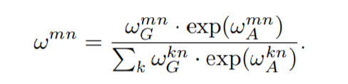

# Relation Networks for Object Detection

## 0. Summary

## 1. Research Objective

在目标检测中引入注意力机制，利用目标间的关系，协助进行目标检测。

## 2. Background and Problems

+ 目标间的关系一直被认为能够协助进行目标检测，在深度学习盛行之前，许多工作利用目标间关系，如同时出现的概率、位置及大小等协助进行目标检测。
+ 已有的深度学习方法对不同目标分别进行预测，没有考虑目标间关系。
  + 一方面是目标关系建模的困难，目标可能是任意数量、尺寸且出现在图像的任意位置。
  + 没有工作发现传统方法中使用的目标关系建模方法在深度学习同样有效，可能在卷积网络中通过大感受野提取的上下文信息隐式包含了传统方法中使用的关系信息。
+ 深度方法中会生成许多冗余结果，NMS是常用的去冗余操作，可以视为利用proposals间的关系进行计算的（proposals间的IoU及分类得分），因此可以利用关系建模取代NMS操作。
+ ***Problem***：使用注意力机制对不同目标间的关系进行建模，目标相比单词更加的复杂，有2D空间上的尺度、长宽比等区别，需要针对目标的几何信息优化自注意力机制。

## 3. Method

+ 在原有自注意力的基础考虑几何特征，此时每个bbox包含两方面的特征，一个是语义特征，即bbox范围内提取的主干网络特征；一个是几何特征，这里指的bbox的坐标。

+ 自注意力的计算方式保持不变，仅对注意力权重的计算进行修改，softmax的计算中加入几何特征权重。

  

  + 几何权重的计算为

     

    其中 $\varepsilon_G$ 将两个bbox之间的关系映射至高维向量，两bbox间的关系通过一个四维向量表示：

    

    > 该式子与bbox的回归目标类似，但是前两项加了log函数，可能使为了对较近的bbox之间的中心坐标间距更加敏感。
    >
    > + 将该四维向量映射至高维空间的方法与Transformer中的位置编码相似，具体方式待了解。

    得到高维向量后通过线性映射得到几何权重。

    > 这里将得到的权重通过一个ReLU函数，论文中说该操作可以限制利用的目标间关系为特定的几何关系，具体代表的是bbox间的什么关系，还有待了解。

+ 使用多头注意力，为了保持输入输出的维度相同，每个注意力头的输出维度为 d / Nr，其中Nr表示注意力头的个数。最终得到的注意力模块如图所示。

  

  > 保持输入输出一致的好处是使得设计的模块能够作为插件，在不影响已有网络结构的情况下使用。

+ NMS在去除冗余预测结果方面表现良好，但是人为选择超参数及贪婪的特性，使得其得到的结果通常是次优的。NMS是基于bbox间的关系进行冗余去除的，关系模块也能够进行冗余去除的工作。

  + 将冗余去除视为一个二分类任务，即目标是否属于冗余结果。

  在分类得分的基础上，增加一个冗余判别的得分，bbox的最终得分由两者相乘得到。

## 4. Evalution

## 5. Conclusion

## Notes

## References

