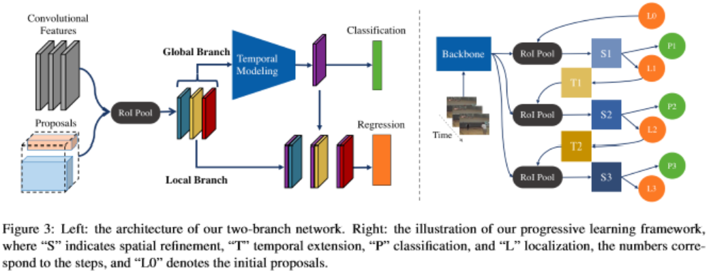

# (CVPR 2019) STEP: Spatio-Temporal Progressive Learning for Video Action Detection

## 0. Summary

将多阶段的方式引入行为识别的思路值得学习，但是STEP依旧需要设置proposals相关的超参数，同时对于一些复杂情况，例如目标数量聚集或数量过多时，没有进行考虑。

## 1. Research Objective

使用多阶段预测的方式，解决ACT中无法处理长视频切片及anchor数量多的问题。

## 2. Background and Problems

+ 视频中的检测问题有两大挑战：

  1. 目标在空间上的移动。

  2. 分类需要使用时序信息。

+ 已有使用时序信息的方法可以分为两类：切片级的预测方法及自适应proposals

  + 切片级预测直接获得输入切片的预测结果，但是3D proposals在空间上位置不变的假设使其无法应对目标运动幅度大及长视频切片的情况。
  + 自适应proposals在预测前先获得对应的proposals，但是这类方法需要一个离线的连接算法来获得proposals。

+ ***Problem***：如何使用多阶段的方式处理更长的视频切片。

## 3. Method

+ STEP两大组件：

  

  + 多阶段的空间定位：
    + 设计动机：模型输出的目标框相比输入的proposal更加贴近目标。
    + 由于proposal会不断优化至目标框，所以不需要使用大量的anchor，仅通过少数大范围的proposals即可。（需考虑图像中可能出现的目标数，若目标数超过proposals数网络会预测失败。
    + 分支1-分类分支：使用3D卷积提取时序及空间上下文信息。
    + 分支2-回归分支：目标的定位需要当前帧中准确的空间信息，因此仅将当前帧的特征作为输入。同时将分类分支中的特征作为补充信息与单帧特征concat，提供上下文信息。
  + 时序信息的扩展：
    + 随着阶段数增加，用于预测的时序信息沿时序维度进行扩展。
    + 由于随着step增加，目标框更加贴近目标，同时增长时序信息引入的噪声不会太大，还能引入更多的时序上下文帮助预测。
    + 扩展方式1-外推：通过已有切片中目标大小的变化趋势外推，通过简单的线性函数得到添加的切片中proposal的位置。
    + 扩展方式2-预期：使用一条新的网络分支用于预测下一个切片相对于当前切片的proposal偏移。

+ 网络训练

  + 先进行前向传播获得所有阶段的输出，再根据输出与gt之间的关系选择正负样本。
  + 由于不同阶段的输出分布不同，随step增加，输入结果与gt的重叠程度逐渐增加，不同step使用独立的网络。
  + 样本选择中保持正负样本的比例平衡，同时更难得样本被选择的概率更大。

+ 扩展：

  + 在ROI　Pooling中加入全图的上下文信息，即一个全图的ROI池化。
  + 多模态数据：使用early、late、mean、union及hybrid等混合方式。
  + Tubelet连接：对ACT中的连接算法进行改进。

## 4. Evalution

+ 多阶段的空间定位十分有效。
+ 多steps的方式不仅能提升最终性能，对于其中每一个step对于的网络性能也有提升。
+ 逐步增加时序信息的方式十分有效。
+ 多模态信息能够提供额外的信息提升网络性能。
+ 全局上下文信息对后面阶段的性能提升较大，可以看出当bbox更加贴近目标是，时序信息对行为分类的重要性。
+ STEP能够达到state of art的水平，同时能够应对目标尺度变化的问题。

## 5. Conclusion

+ 提出了STEP能够处理更长的视频切片，同时通过多阶段的方式提升网络的性能。
+ 大大减少了proposal的数量，能够减少网络的计算量。

## Notes

+ 网络模型的性能受proposals的数量及设置的影响，且在图像目标数较大时，proposals的数量如何选择？目标聚集时，一个proposals中可能包含多个目标，此时模型如何应对？

## References

[16, 20]
