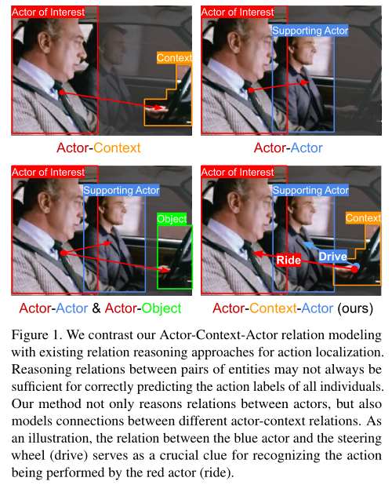
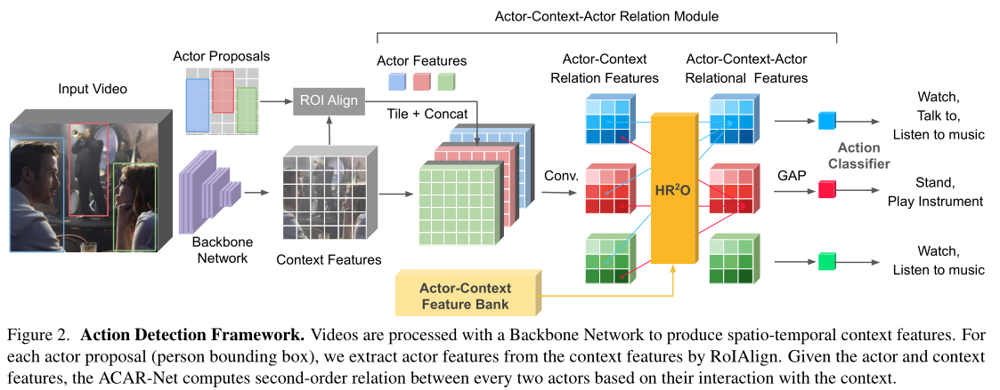

# (CVPR 2021) Actor-Context-Actor Relation Network for Spatio-Temporal Action Localization

## 动机

### &1 Actor-Context-Actor Relation

Actor-Context-Actor的二阶关系对动作识别十分重要，该关系是两人体实例间基于上下文的联系，例如在下图中要判断红色框内的人是乘车而不是开车，在已知红色框中的人及蓝色框中的人，或者红色框及方向盘时，无法判断红色框中人的动作类型。

只有知道蓝色框的人与方向盘之间的关系是驾驶，而红色框的人位于车内，才能判断红色框内的人是在乘车。

### &2 已有方法的不足

有一些工作使用图卷积网络来隐式建模人体与上下文目标之间的高阶联系，然而这些方法需要一个额外的目标检测器，且仅有被定位的目标被视为上下文。

+ 由于数据集中没有除人体外目标之外的定位信息，该目标检测器仅能在其他目标检测数据集上进行预训练，**且检测的目标类别被数据集提供的类别所限制**，无法识别在动作识别数据集中出现而在目标检测数据集中未出现的目标类别。

+ 仅将定位的目标作为上下文会丢失重要的环境或背景信息，这些信息对于动作类别的判定也十分重要。

为了解决解决上述问题作者提出了Actor-Context-Actor Relation Network(ACAR-Net)。

## 方法

### &1 网络框架

ACAR-Net是基于Faster RCNN网络的两阶段方法，将输入clip的中间帧作为关键帧，人体检测器在关键帧上进行预测，获得 $N$ 个人体。主干网络从输入clip从提取时空间特征，并使用**平均池化**将特征图大小转化为 $X\in\mathbb{R}^{C\times H\times W}$，来减少计算开销。

使用RPN网络得到的候选区域从 $X$ 中提取不同人体对应的特征，使用 $7\times 7$ 的 RoIAlign池化及最大池化得到 $N$ 个人体特征， $A^1, A^2,\cdots,A^N\in\mathbb{R}^C$，其中包含了空间及时序信息。

### &2 ACAR建模

#### &2.1 一阶 actor-context关系编码

将人体实例对应的特征向量 $A^i\in\mathbb{R}^C$ 与时空间特征图 $X\in\mathbb{R}^{C\times H\times W}$ 的每个元素进行拼接，得到一组特征图 $\{\hat{F}^i\}_{i=1}^N\in\mathbb{R}^{2C\times H\times W}$。

> 对每个特征图 $F_i$ 进行卷积可以得到该人体实例与输入clip中context的关系特征。