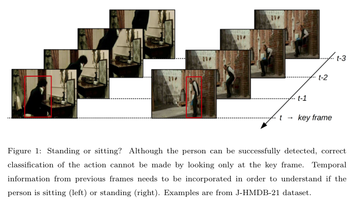

# (CVPR 2021)You Only Watch Once: A Unified CNN Architecture for Real-Time Spatiotemporal Action Localization

## 1. 动机

**时空视频的动作定位(spatiotemporal human action localization)** 不仅需要在空间上定位人体动作在空间上的位置，还需要在时序上定位动作的起始，并对该动作进行分类。

相比静态的目标检测，时序信息对时空视频的动作定位十分重要，对于单帧图片能够成功地定位人体的位置，但是该人体的动作需要结合过去帧的信息才能正确判断。（*例如站起和坐下的区分*）因此 ==**如何结合时序和空间信息十分重要**== 。

受Faster RCNN网络框架的启发，大部分已有方法都属于两阶段方法，存在一些不足：

1. action tube的生成需要对不同帧生成大量的候选区域，相比2D情况下更加的复杂和耗时。

   > action tube 是对每一帧中检测出的bounding box进行链接得到的

2. 网络对人体动作的分类将基于生成的候选区域进行分类，候选区域的质量将影响分类的性能，同时仅依赖候选区域中的人体特征，忽视了**人与人或物交互的信息及一些背景信息**。这些上下文信息对动作识别十分重要。

3. 分别训练RPN网络及分类网络无法保证得到全局最优的模型。

   > 分别训练时，RPN网络和分类网络都能达到各自的全局最优，但是组合起来得到的最终模型并不一定是最优的。

4. 相比一阶段方法，两阶段方法的训练时长较长，需要更多内存。

### 主要贡献

作者提出YOWO的一阶段方法来避免上述二阶段方法的缺点，同时使用不同的输入分支提取时序和空间信息。添加不同的输入分支能够为网络提供其他不同模特的数据。

其中YOWO从历史帧中提取时序信息。为了更快的运行速度，YOWO最多处理16帧的输入，然而如此短的clip输入提供的时序信息是有限的，而更长的输入会减慢网络的运行速度。

> 对于视频中不同帧的预测可能会对同一段视频帧进行重复处理？

## 2. 方法

### YOWO 网络结构

YOWO的网络结构可以分为四个部分：3D-CNN分支、2D-CNN分支、特征融合及bbox 回归部分。

#### &1 3D-CNN 分支

该分支使用3D卷积从多个连续的视频帧中提取时序信息，能够使用不同的3D卷积网络进行替换。

这里使用 3D ResNext-101作为该分支的网络结构，输入数据的大小为 $[C\times D\times H\times W]$ ，输出大小为 $[C'\times D'\times H'\times W']$ ，其中 $C=3,D$ 是输入帧的数量， $H,W$ 表示输入帧的高宽， $C'$ 表示输出通道数， $D'=1,H'=\frac{H}{32}, W'=\frac{W}{32}$ 。这里将  $D'=1$  是为了 **与2D-CNN分支的输出大小适配** ，方便后续进行特征融合。

> 
>
> 对于多帧图片，2D卷积的输出通道数都为1，而3D卷积的输出通道数能够大于1，Du[1](#refer-anchor-1) 认为2D卷积的输出结果缺乏时序信息，而3D卷积的输出保留了时序信息。
>
> 若将卷积对通道数的处理退化为一维情况，则如下图所示：
>
> 
>
> 2D卷积相比3D卷积参数量较少，且不能对输出特征进行进一步处理（2D卷积的输出结果维度为1）。
>
> 3D卷积参数量较多，且能通过多次卷积提取更丰富的时序信息，而2D卷积提取的时序信息十分有限，与3D卷积相比会丢失大量时序信息，从该角度看能够理解Du的观点。

#### &2 2D-CNN分支

该分支从当前帧中提取空间信息，用于定位画面中人体实例的位置，该分支可以使用任意2D卷积网络代替。

这里使用Darknet-19作为基础架构，输入大小为 $[C\times H\times W]$ ，输出大小为 $[C''\times H'\times W']$，其中 $C=3,C''$ 是输出通道大小， $H'=\frac{H}{32}, W'=\frac{W}{32}$ ，与3D-CNN分支的输出大小适配。

#### &3 特征融合：通道融合和注意力机制(Channel Fusion and Attention Mechanism)(CFAM)

由于对两种特征进行拼接得到的特征 $A\in\mathbb{R}^{(C'+C'')\times H\times W}$ 只是两种特征的简单组合，忽略了两者间的相互关系。因此先使用两个卷积层对特征进行初步处理，得到       $B\in\mathbb{R}^{C\times H\times W}$。

> 这里的卷积注重局部的特征融合，而注意力机制是全局的特征融合。

使用基于格拉姆矩阵的注意力机制进行特征融合，将特征图进行变形，将每个通道的特征转换为向量，其中 $N=H\times W$ 得到 $F$
$$
B\in\mathbb{R}^{C\times H\times W}\stackrel{vectorization}{\longrightarrow} F\in\mathbb{R}^{C\times N}
$$
通过矩阵$F$与其转置$F^T$相乘得到格拉姆矩阵 $G\in\mathbb{R}^{C\times C}$ ，表示不同通道之间的相关性。
$$
G=F\cdot F^T\quad with\quad G_{ij}=\sum_{k=1}^NF_{ik}\cdot F_{jk}
$$
对矩阵$G$的每一行使用softmax进行归一化，得到注意力矩阵 $M\in\mathbb{R}^{C\times C}$
$$
M_{ij}=\frac{exp(G_{ij})}{\sum_{j=1}^Cexp(G_{ij})}
$$
之后使用注意力矩阵与矩阵$F$相乘，之后变形为与输入大小相同的张量。
$$
F'=M\cdot F,\qquad F'\in\mathbb{R}^{C\times N}\stackrel{reshape}{\longrightarrow}F''\in\mathbb{R}^{C\times H\times W}
$$

> 后续需了解：基于格拉姆矩阵的注意力机制与一般的注意力机制的不同。

将通过注意力机制得到的特征图$F''$ 与输入特征图$B$ 进行组合得到特征图$C$，其中$\alpha$属于标量参数，且逐渐从0开始学习。
$$
C=\alpha\cdot F''+B，\quad C\in\mathbb{R}^{C\times H'\times W'}
$$

> 这里在注意力模块的输入与输出间添加残差链接，能够解决梯度消失的问题。

最后需要经过两个卷积层得到CFAM模块的输出特征图$D\in\mathbb{R}^{C*\times H\times W}$，开头与结尾的两个卷积层对CFAM模块十分重要，缺少这两处卷积层，**CFAM对网络性能的提升将大幅减少**。

#### &4 BBox 回归

这部分与YOLO中对bbox的回归相同，通过$1\times 1$卷积来得到想要的输出通道数，对大小为$H'\times W'$的输出特征图的每个元素，设置5个先验锚点（**锚点的数量是通过在对应数据集中使用$K-Means$算法得到的**），对每个锚点有$NumCls$个类别得分、4个坐标及是否包含目标的自信度得分，因此YOWO的最终输出特征图大小为$[(5\times(NumCls+5))\times H'\times W']$。

在训练中是使用不同分辨率的输入进行训练，在测试中使用$224\times 224$固定分辨率的输入。选择的mini-batch梯度下降策略及权重衰减策略与YOLO相同，**但是使用L1 loss作为定位损失，focal loss作为分类损失**。

> L1 loss 对离群点的敏感度低于L2 loss，同时学习得到的权重较为稀疏，而L2 loss学习得到的权重较为密集。

### 实现细节

| 网络                                     | 选择                                      |
| ---------------------------------------- | ----------------------------------------- |
| **3D network parameters initialization** | pretrained models on Kinetics             |
| **2D network parameters initialization** | pretrained models on PASCAL VOC           |
| **learning_rate**                        | 0.0001                                    |
| **decay factor**                         | 0.5 after 30K, 40K, 50K and 60K iter      |
| **iterations**                           | UCF101-24(5 epochs)，J_HMDB-21(10 epochs) |
| **Env**                                  | PyTorch, a single Nvidia Titan XP GPU     |

+ 由于J-HMDB-21的数据量较少，在训练过程中保持3D卷积网络的参数值不变，防止过拟合的同时，加快了网络的收敛速度。
+ 在测试中选择自信度得分$> 0.25$的的bbox，在后处理阶段，非最大值抑制的阈值设置为0.4。

### 连接策略

使用已有的连接算法来得到最有的结果。

其中$S_c(R_t),S_c(R_{t+1})$是区域$R_t,R_{t+1}$的特定类别的得分，$ov$为两区域的IoU值，$\alpha, \beta$属于标量，$\psi(ov)$属于限制函数，当$ov >0$时为1， 其余情况为0，即要求两区域存在交集。得到所有的连接得分后，使用**VIterbi算法**得到最优路径获得action tube。

### 长距离特征库

由于最多16帧的输入限制了YOWO对时序信息的提取，影响动作识别的性能，使用LFB(long term bank)为YOWO提供更多的时序信息。

LFB中包含了使用预先训练好的3D ResNeXt-101主干网络在视频的不同时间段提取的特征，在网络推断过程中，将**以当前帧为中心的前后时间段的特征作为CFAM的输入之一**。

> 该方法会为网络提供未来的时序信息，且在使用主干网络提取特征时，会对视频中的同一视频帧进行多次计算。

## 3. 实验结果

#### 消融实验

**参考文献：**

- [1] [ICCV]([ICCV 2015 Open Access Repository (thecvf.com)](https://openaccess.thecvf.com/content_iccv_2015/html/Tran_Learning_Spatiotemporal_Features_ICCV_2015_paper.html))
