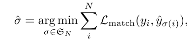
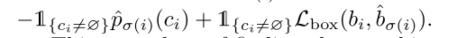
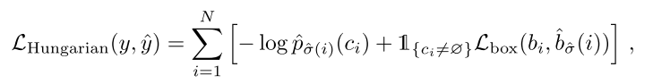
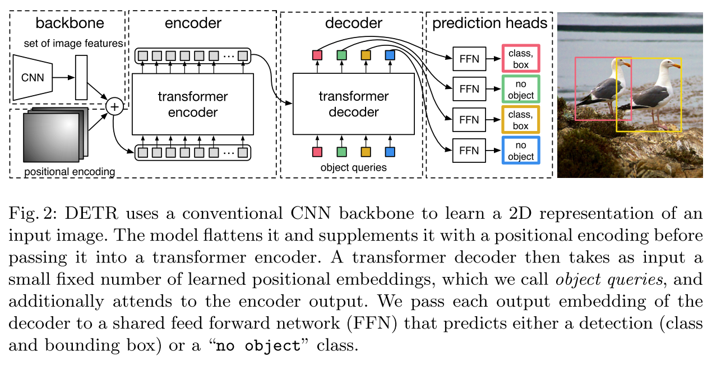

# （ECCV 2020)End-to-end object detection with transformers

## 0. Summary

需要人为设置的操作通常会导致次优的结果，通过将目标检测视为集合预测，通过双向匹配及Transformer来消除这些人为操作。但是为了能够在全图计算注意力，会将原图片下采样至 1/32再计算注意力，在小目标上的性能较低。

## 1. Research Objective

简化目标检测的流程，去除NMS、Anchor设置等需要人为设置的操作。

## 2. Background and Problems

+ 目标检测的目的是检测出目标的位置及类别，已有的检测方法大多通过间接方式解决：
  + 没有对目标直接进行回归，通过设置大量的proposals、anchors或window centers来对目标进行回归和分类。
  + 网络的最终性能很大程度上依赖于后处理，例如NMS。
+ 可以将目标检测视为一个集合预测任务，能够自然地引入注意力机制对集合中不同元素间的关系进行建模。（为何使用Transformer？）
+ 集合预测：
  + 基础的集合预测问题有多分类问题，可以采用one-vs-rest的方式解决。
  + 检测任务的元素之间有底层结构，存在相似的结果。这类问题的一个困难是如何去冗余？
    + 大部分已有检测方法使用后处理。
    + 使用直接集合预测的方法无需后处理，但是需要对所有预测元素间的关系进行建模，以此进行全局推断，避免冗余。
    + 对固定大小的集合预测，可以使用全连接的方法，十分有效但是开销巨大。一般使用自回归的序列模型，如RNN。
    + 无论使用哪种方法，集合预测的损失函数都应具有排列组合不变性，通常做法是基于Hungarian算法来发现预测结果与真值的双向匹配。
+ Transformer和并行解码：
  + 基于注意力的模型的主要优势在于：全局计算和较小的内存消耗
  + Transformer最先使用在自回归的模型上，结果输出是one by one的，不能同时输出所有结果。
+ 目标检测：
  + 已有的目标检测方法的最终性能很大程度上依赖于初始结果的设置（还有后处理）
  + 已有方法使用双向匹配损失，但是不同预测间的关系是通过卷积或全连接来建模的，并且使用NMS来提升性能；一些方法使用NMS来获得真值与预测的唯一匹配。以上方法都没有去除NMS操作。
  + 可学习NMS及关系网络能够消除后处理操作，但是这些方法需要人为设定的上下文信息，例如proposal的bbox坐标。
  + 已有的端到端目标检测方法尽在小数据集上测试，且性能不能与现有的baseline相比。
+ ***Problem***：将目标检测视为集合预测问题，使用双向匹配来避免使用后处理，通过使用Transformer结构来取代循环神经网络，达到同时输出所有预测结果。

## 3. Method

+ 双向匹配的的集合预测损失：

  + DETR固定预测N个结果，其中N的数值大于图像中通常出现的目标个数。记针织集合为 y，预测集合为 y-hat，使用非目标类别对y进行填充，使两者大小都为N。

  + 在所有的排列组合中进行搜索，找到使匹配损失最小的匹配方式，损失函数为：

    

    其中 L_match表示 yi 与对应 y-hat的匹配损失，使用匈牙利算法找到最佳匹配方式，匹配损失的计算方式为：

    

    + 仅对与真值计算匹配损失，考虑其分类及bbox损失。

  + 得到匹配方式后，计算预测的损失：

    

    仅对与真值匹配的预测结果计算bbox损失，对所有结果计算log 分类损失，且不考虑负梯度。

    + 降低非目标的分类损失权重来解决类别不平衡的问题。
    + 匹配损失中不使用log分类损失是为了平衡其与bbox损失项的大小，从经验上看可以得到更好的结果。

  + 对bbox的回归损失通常采用 L1 损失，但是该损失没有考虑目标尺度的不同，对于一个大目标和一个小目标，其相对误差相差不大的情况下，其L1损失值相差较大。

    + 将L1损失及泛化IoU损失的线性组合作为BBox的回归损失。

+ DETR的结构：

  

  1. 用于提取特征的CNN主干网络，输出特征图大小为 (2048, H0 / 32, W0 / 32)，其中H0，W0表示输入图像的高宽。
  2. Transformer编码器：首先使用一个1*1卷积将特征图的通道数减少至d；之后将特征图按空间维度展开，展开成一个个d维向量；与固定位置编码一起送入编码器。
     + 每个编码器包含一个多头注意力模块及前向传播网络。
  3. Transformer解码器：同时对N个目标进行处理，N个嵌入向量使学得的位置编码，记为object queries，通过解码器转化为输出嵌入，之后每个输出独立的进行bbox坐标及分类的预测。
  4. 最终输出由一个三层感知机获得。
  5. 对不同的目标使用相同的Layer Norm层级预测头，并且将Hungarian损失作为decoder层的辅助损失。

## 4. Evalution

+ DETR与其他Transformer相同，需要更长的训练时间，且使用dropout、Adam或Adagrad优化器。与Faster RCNN相比对大目标的性能较好，但是对于小目标的性能下降。

+ 消融实验：

  + 编码器在区分目标实例上十分重要，编码器似乎将不同目标实例区分开，简化了解码器的目标提取及定位。

  + 逐渐增加解码器的个数，相应的AP、AP50上升。

  + 在不同的decoder层后加入NMS操作，在前三层能够带来性能提升，且随着层数增加性能提升逐渐减少，到5、6层后性能甚至会降低，可以看出DETR能够不采用去冗余的后处理操作。

  + 通过可视化发现decoder的特征集中于目标实例的局部，相比encoder对实例的区分，decoder更注重实例的类别及边界。

    > 与两阶段方法十分类似。

  + Transformer中的前向传播网络及位置编码都十分重要。

+ DETR能够通过很少的训练，迁移至全景分割任务中。

## 5. Conclusion

+ DETR能够在简化目标检测流程的同时，达到与最优化的Faster RCNN相近的性能。
+ 但是DETR在小目标的性能上需要提升。

## Notes

+ Hungarian Algorithm 匈牙利算法：[Hungarian Algorithm匈牙利算法_Simy Hsu's Blog-CSDN博客_匈牙利算法复杂度](https://blog.csdn.net/u014754127/article/details/78086014)
+ FLOPS：floating point operations per second，每秒浮点运算次数，用来衡量硬件性能。
+ FLOPs：floating point operations，表示浮点运算数，用来衡量模型的计算复杂度。

## References

+ Parmar, N., Vaswani, A., Uszkoreit, J., Kaiser, L., Shazeer, N., Ku, A., Tran, D.: Image transformer. In: ICML (2018)
+ Rezatofighi, H., Tsoi, N., Gwak, J., Sadeghian, A., Reid, I., Savarese, S.: General- ized intersection over union. In: CVPR (2019)
