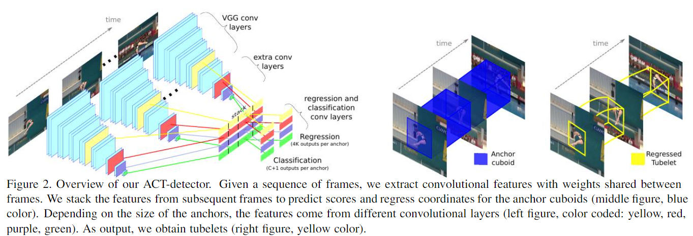

# (ICCV 2017)Action Tubelet Detector for Spatio-Temporal Action Localization

## 0. Summary

anchor cuboid的假设能够利用时序信息，但是空间位置不变的假设导致其无法应对长视频切片及目标运动幅度大的情况，同时还保留了anchor设置本身的问题，例如模型会依赖于anchor的设置，及大量的anchor会增加模型的计算量。

## 1. Research Objective

已有方法对视频进行逐帧预测，之后进行连接或跟踪。这些方法将视频视为帧的集合，不同帧之间是独立的图像，没有利用不同帧时序上的信息，本文将视频视为帧序列，使用时序信息来协助进行行为识别。

## 2. Background and Problems

+ 最早的时空间行为识别方法基于滑动窗口，该方法需要很强的假设，例如立体的滑动窗口假设目标的位置随时间不会改变。
+ 逐帧检测的方法在每帧上独立进行目标检测，之后使用连接算法或跟踪来生成最后的结果。
+ 多模态方法在RGB图像的基础上加入光流图提供补充信息，协助进行行为识别，也需要进行连接生成最终结果。
+ ***Problem***：基于目标检测方法，如何在时序维度上进行扩展；一次预测多帧图像，如何进行连接？

## 3. Method

+ 将目标检测中的anchor引入行为识别中，将anchor在时间维度上进行扩展，形成立体的anchor。

+ 网络结构：

  

  + 使用主干网络对不同输入切片的不同帧分别提取特征，只要是基于anchor的目标检测网络都可以作为主干网络，得到的特征进行拼接作为后续分支的输入。

  + 分支1-分类分支：对anchor内的行为进行分类。

  + 分支2-回归分支：对切片中每一帧目标相对于anchor的偏移进行回归，虽然anchor的空间位置保持不变，但是输出结果中目标的位置是移动的。

    > 由于目标会在anchor附件进行移动，anchor对于的感受野应该比anchor更大。

+ 训练：训练中仅使用每帧都包含action的切片作为训练数据。

  > **文中将一个anchor与多个gt进行对应，是否对最终结果由影响？**

+ **连接算法需阅读代码！**

## 4. Evalution

+ MABO（Mean Average Best Overlap)：不同类别的平均overlap取平均。能够表现定位的精度。
+ 通过统计，UCF、JHMDB等数据集中10帧之内，目标的平均移动幅度小于40%，证明了anchor cuboid的可行性，但是这并不代表现实场景。
+ 输入切片超过10帧后，召回率及准确率都开始下滑。
+ 对数据集的错误结果进行分析发现
  + 时序信息对减少定位误差及误检帮助不大。
  + 时序信息对于行为分类十分重要。
  + 实验中发现随帧数增加，模型的定位精度上升，但是通过误差分析发现定位误差变化不大。定位精度的提升可能是由于分类正确带来的

## 5. Conclusion

+ 对anchor进行扩展，利用时序信息协助进行行为识别。
+ 提出适合逐切片预测方法的连接算法。

## Notes

+ 立体anchor在不同帧中空间位置相同，导致模型不能应用在更长的视频切片上和目标运动幅度大的场景下，这是由于目标会逐渐运动至anchor对应得感受野外，模型难以预测。
+ 逐切片预测的方法由于一次性预测一个切片的结果，对于训练数据的要求比较严格，一个输入切片只能包含同一类别的一个实例。检测阶段并不能判断行为在视频中的时序边界，只能依靠后续的连接算法。
+ 此外，更长的视频切片会使训练数据减少，这是由于满足条件的长视频切片不多。

## References

[33, 22, 25, 29]
