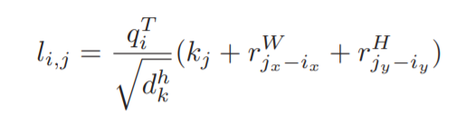
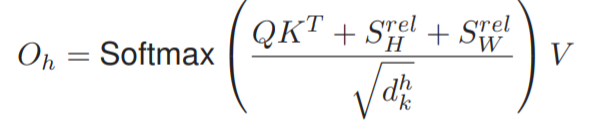

# Attention Augmented Convolutional Networks

## 0. Summary

从取代卷积操作的角度出发，希望设计的自注意力模块能够保留卷积操作的优点，并由此提出相对位置编码，思路清晰。虽然达不到取代卷积的程度，但是能够作为卷积的替代操作，且作为卷积的增强模块，能够在分类及目标检测的多个框架中带来性能提升。

## 1. Research Objective

在判别视觉任务（图像分类及目标检测）中使用注意力机制取代卷积操作。

## 2. Background and Problems

+ 卷积网络具有局部性及平移不变性的特点，但是卷积操作无法获得长距离依赖，而这对于目标识别十分重要[33]。

+ 自注意力机制具备排列组合不变性，不适合于图像这种结构化的数据，需要图像中各像素的结构信息。

+ 平移不变性是处理图像时需要满足的特性，而自注意力机制没有该特性。

  > 排列组合不变性包含了平移不变性，但是在图像处理中，应当保留平移不变性的部分。

+ 视觉任务中已有一些工作引入了自注意力机制：

  + Squeeze and Excitation及Gather Excite方法对特征通道进行注意力计算。
  + BAM及CBAM方法分别对通道及空间维度计算注意力。
  + Non local神经网络在卷积网络中加入自注意力模块。

+ 已有方法中使用位置编码使注意力机制不具备排列组合不变性，但是没有保留平移不变性。在语言建模中有使用相对位置编码来保留平移不变性的同时防止排列组合不变性。

+ ***Problem***：在自注意力机制中加入像素的相对位置信息，去除其排列组合不变性的同时保留平移不变性。

## 3. Method

+ 保留自注意力机制的基本框架，使用多头注意力获取长距离以来，仅对注意力权重的计算方式进行修改，加入像素间的相对位置关系。

+ 对x、y方向分别计算相对距离，此时的注意力权重为：

  

  其中的r分别表示两个轴方向上两像素相对位置的嵌入向量，嵌入向量的计算方式于Transformer中的位置编码相同。此时注意力头h的输出为：

  

  其中S中的元素为query向量与对于的相对位置嵌入向量的乘积。

  > 由于计算的是相对位置关系，S[i, j] = S[i, j + W]，新增的参数量为 (2(H + W) - 2)dk，其中有一项是 i = j时的结果。
  >
  > + 若是采用绝对位置关系，需要存储的将矩阵大小为 WH * WH * dk，而多头注意力的注意力图大小为 WH * WH * Nh，位置信息矩阵的大小会大过注意力图的大小，大大增加内存消耗。

+ 注意力与卷积同时计算，将得到的两种特征进行拼接，能够通过通道数的比值来控制两种特征的比例。

+ 提出的注意力增强卷积与卷积相同：

  + 具有平移不变性。

  + 能够处理不同分辨率的图像。

    > 这里有两个疑问：
    >
    > 1. 当分辨率小于训练时的最大分辨率时，可以使用学习好的相对位置信息，但是当分辨率大于训练时的最大分辨率时，有些像素对的相对距离信息是没有学习的.
    > 2. 当图像的分辨率发生改变时，相邻像素间距离的含义是否发生改变，即720 * 720和1080*1080的图像中，相邻两像素之间的差距应该是不相同的，是否在考虑相对位置关系的时候考虑间距与图像尺度的比例。

+ 注意力增强卷积后，使用BN进行标准化，可以对卷积特征和注意力特征的贡献进行缩放。

  > BN是如何做到缩放两者的贡献的？需要阅读代码。

## 4. Evalution

+ 在图像分类中，拥有较低参数的同时，性能稍微优于SE、GE等方法（零点几的提升）。

+ 对每个像素进行注意力计算，计算开销大，所以在注意力模块之前会有池化操作进行下采样，但是该操作会降低模型的空间精度。
+ 消融实验：
  + 不断增大注意力特征的比重，网络的性能不断下降，作者认为一部分原因是注意力模块开头的平均池化操作导致的。
  + 注意力完全取代卷积后，参数量有所下降，性能下降不多，能够作为卷积的替代操作，但是无法取代卷积。
  + 位置编码对注意力的性能影响大，可以看出位置编码对注意力的重要性。

## 5. Conclusion

+ 设计了考虑相对位置的自注意力模块，可以作为卷积的替代操作，应用在网络结构搜索中。
+ 将设计的注意力模块用于增强卷积操作，能够在图像分类及目标检测的多个框架中带来稳定的性能提升。

## Notes

## References

