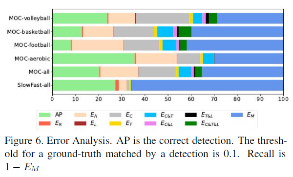

# MultiSports : A Multi-Person Video Dataset of Spatio-Temporally Localized Sports Actions

## 0. Summary

针对时空间行为定位的应用场景，主要是运动监测方面提出了一个更符合应用场景要求的数据集，但是像监控、违规行为检测等应用场景，人体可能同时进行多个需要检测的行为的应用场景下，该数据集还有所不足；作者还在提出数据集的基础上进行分析，发现该数据集的难点和特点，为后续研究提供方向。

## 1. Research Objective

​		针对时空间行为定位的应用场景，提出一个比已有数据集更符合应用场景特点的高质量数据集。

## 2. Background and Problems

+ 早期行为识别数据集专注于行为分类，数据集包括人为处理过的短视频切片，来保持一个切片中仅包含一种行为；**背景场景信息过多**，使得学得的模型通过场景而不是对人体动作的分析来对行为进行分类。

  > 场景信息过多，会导致模型在学习中偏向使用场景信息进行行为分类，而数据集中不同行为的场景是无法包含该行为可能出现的所有场景的，与现实情况有所偏差，从而导致学得模型性能不高。

+ 在分类的基础上增加了时序定位就有了时序行为检测数据集，但是数据集中一个视频切片仅包含一个类别的行为，相对简单。

+ 已有的时空间行为定位数据集可以分为两类：

  1. **密集标注的高层级动作数据集**（J-HMDB、UCF101-24等）：每个切片只有一个人体，且行为类别的层级高，在时间维度上一直重复，即整个切片都是相同类别的行为。
  2. **稀疏标注的元行为数据集**（AVA）：
     + 仅对切片中的个别帧进行标注，注重空间上的行为定位，时序上的行为边界模糊。
     + 行为层级低，例如站、坐等基础动作，不太需要复杂的推理及周围的环境信息。
     + 行为的速度不快，动作不大，适合用于日常行为的识别，不适合于监控、运动监测等应用场景。

+ ***Problem***：针对时空间行为定位的应用场景，新的数据集应当满足几个要求：

  + 多人场景，即同一场景下有多个人体，且不同人体可以进行不同类别的行为。这使得模型不能通过场景判别行为的类别，需要对人体的动作进行分析。

  + 有清晰的时间和空间边界，已有数据集中对行为的时序边界定义模糊，导致相同类别的行为的时序边界不一样。

  + 考虑到现实世界应用的复杂性，合理设计行为类别的粒度。

    > 例如在运动监测中，运动的类别层级太高，而基础动作如跑、跳层级太低。

## 3. Method

+ **行为类别的选择**：在篮球、排球、足球及体操运动数据上进行行为类别的选择。

  + 选择这四类运动的理由：

    + 满足多人场景的要求，在同一场景下不同的人在进行不同的行为，且背景相对简单。

    + 运动中的不同的行为有好的行为定义及边界。

      > 在其他一些应用场景下，一个人可能同时进行几种需要检测的行为？例如快递员的违规行为检测。

    + 由于运动的复杂竞技规则，对一个行为的判定需要长距离建模，及人体与不同目标、场景的交互。

  + 首先让专业运动员给出不同运动中的行为，并编写一个手册对不同的行为进行行为及边界的定义。

  + 之后让几位运动员进行少量标注，根据标注中出现的问题对行为类别进行完善。

  + 为了保持行为边界的清晰，不考虑普遍的行为及元动作，同时不包含犯规行为。

    > 这些行为的定义模糊，犯规行为在视觉上也是模糊的，在视频中主要通过裁判的反应判断是否犯规。

+ **数据准备**：从YouTube上选择不同国家不同赛事的视频信息，每个视频都是720P或1080P的，同一个视频切片保持在一个分镜下。

+ **数据标注**：运动员先进行开头帧的bbox及切片中行为类别及时序边界的标注；之后在FCOT的帮助下完成其他帧的标注。

+ 数据集的优势：

  +   相比其他数据集的未处理视频切片长度更长，更多的行为类别，更多的目标实例及每个切片的平均实例更多。
  + 在已有数据集中包含最多的bbox标注；由于准确的行为和边界定义，行为的平均持续时间更短。

+ 数据集的挑战：

  + 数据分布方面
    + 不同行为类别的数据量分布呈长尾分布。
    + 数据中行为实例的时长不一，模型难以准确定位行为的时间边界。
    + MultiSports中的行为推断通常需要更长的时序上下文信息及上下文之间的交互。
  + 数据集特点：
    + 多人场景下模型需要区分不同行为之间的细微差别。
    + 运动场景下，动作的幅度更大，速度更快。

## 4. Evalution

+ 评价指标：使用frame-mAP及video-mAP两种指标，其中video-mAP使用3D IoU作为计算标准。
  + 3D IoU = 时序 IoU * 重叠时段的平均 IoU
  
+ 人为定义了十类不同的误差，对数据集上的误差进行分析:

  

  + EN表示一些没有运动的人体被检测出来，而这些人体被视为负样本。
  + 时序上定位不准确的错误很多。

+ 消融实验

  + 虽然MultiSports的平均行为时长更短，但是增大输入长度后，获得的性能提升比UCF101-24大，可以看出时序信息对于该数据集的重要性。
    + 但是该提升仅针对frame-mAP，video-mAP在更长输入的情况下，在MultiSports上性能没有提升。也许是因为使用的MOC模型在长输入的情况下难以进行预测；且数据集本身行为时长不统一导致的。
  + 对不同类别的行为进行分析：
    + 与场景高度相关的行为，即使数据量较小，学得的模型依旧可以预测得很好，例如罚球。
    + 时长短且动作密集的行为即使有大量的训练数据，也很难进行预测，例如传球。

## 5. Conclusion

+ 针对时空间行为定位的应用场景提出了一个数据集。
  + 提出了新的挑战，在多人场景下的行为识别。
  + 高质量且密集的信息标注。
  + 在运动分析领域的应用潜力。
  + 从来自不同国家不同赛事的影像中获取，多样性更高。
+ 在提出的数据集的基础上进行误差分析及消融实验，法相该数据集的难点。

## Notes

## References

