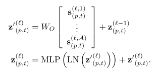

# (ICML 2021) Is Space-Time Attention All You Need for Video Understanding?

## 0. Summary

​		本文的主要工作可以概括为：对ViT进行推广；针对视频理解优化注意力计算方式；进行大量的实验分析不同因素对网络性能的影响，但是一些实验结果作者没有给出解释及实验分析。

## 1. Research Objective

​		在视频分类任务中使用自注意力机制替代卷积操作。

## 2. Background and Problems

+ 视频任务与自然语言处理有相似之处：

  + 视频和句子都序列
  + 对单帧中人体动作的判断需要利用video中其他帧的信息

+  卷积操作对于视频理解任务存在一些限制：

  + 卷积存在较强的归纳偏置（local connectivity and translation equivariance），限制了模型的容量。
  + 卷积只能获得感受野范围内的依赖，且通过多层卷积获得的长距离依赖也是有限的；Transformer能够用来获取长短距离依赖。
  + 深度CNN的训练十分费时，特别是输入高分辨率和长时间的视频时；Transformer的训练和推断速度更快。

  > 卷积操作能够获得局部的位置信息，而自注意力机制会丢失该位置信息。在Transformer中使用位置编码来弥补位置信息的缺失，本文使用相同的方式。

+ 能够将图像理解任务中的方法推广到视频理解任务中，一些图像理解方法使用自注意力机制替代卷积操作，然而这些方法将像素作为queries，计算开销大。

  + **为了减小计算开销**，一些方法：在**局部计算注意力**或**对特征图进行下采样**，并对采样后的结果进行注意力的计算。
  + **为了在全图进行注意力计算**，一些方法：**稀疏key-value采样**或**仅沿横纵轴计算注意力**。
  + Vision Transformer提出将图像分解成不同的patch，对这些patch进行线性映射获得的嵌入向量作为Transformer的输入token。在图像分类上性能优异。

+ 已有工作在视频生成等任务中引入自注意力机制，但是还未有工作使用自注意力机制替代卷积操作。

+ ***Problem***：

  + 将图像分类中的ViT推广至视频理解任务中
  + 视频的patch数量相比图像更多，计算两两token之间的相似度计算开销大，如何减小计算开销。

## 3. Method

+ 将输入clip按帧切分成相同大小的patch，并对每个patch进行线性映射获取对应的嵌入向量。
  $$
  X\in R^{H\times W\times 3\times F}\rightarrow x_{p,t}\in R^{3P^2}, \quad p=1,\cdots,N;t=1,\cdots F \\
  z^{(0)}_{(p,t)}=Ex_{(p,t)}+e^{pos}_{(p,t)},\quad E\in R^{D\times 3P^2}
  $$

  > + 其中$e^{pos}_{(p,t)}$ 表示位置编码，该位置编码表示不同patch之间的位置关系。
  > + 参照BERT Transformer加入分类token的嵌入 $z^{(0)}_{(0,0)}$，带了解。

+ Query-Key-Value值计算：l表示不同block，a代表不同的注意力头。

  

+ 使用分散注意力，先计算时序注意力再计算空间注意力。

  

  > 时序注意力的计算仅对处于同一位置的patch进行计算。

+ 利用计算出的注意力权重得到输出。

  

  

  > 这里的LN表示LayerNorm，对batch中每个样本分别进行标准化。

+ 分类嵌入：将最后一个block的classification token作为clip的输出。待了解。
  $$
  y=LN(z^{(L)}_{(0,0)})\in R^D
  $$
  

## 4. Evalution

+ 在Kinetics-400、Kinetics-600、Something-Something-V2及Diving-48数据集上进行实验。

  + **训练**：网络使用ImageNet-1K或ImageNet-21K进行预训练；clips的大小为8 * 224 * 224，以 1/32进行帧采样，patch大小为 16 * 16.
  + **推断**：取用视频中间的clip，并对该clip进行三个不同的空间截取（左上，中央，右下），最终结果为三者的平均。

+ 消融实验：

  

  + 分别比较五种注意力计算方式，分散注意力的性能最优。相比ST虽然参数量更多，但是计算复杂度更低。随着输入分辨率的增大及输入clip的长度增加，ST的计算开销迅速增加，而分散注意力线性计算开销平缓增加。

    > 这里分散注意力先计算时序注意力再计算空间注意力，为何比ST效果好？
    >
    > + 或许对同一位置进行时序信息的提取更加合理，对全局会引入噪声？可将patch->pixel 或 patch -> 全图进行实验。
    > + ST注意力相比除分散注意力之外的方式更优。

  + 与3D卷积网络（SlowFast及I3D网络）进行比较：

    + TimeSformer参数量更多，但是推断速度更快，适用于大规模学习。
    + TimeSformer的训练时长更短，3D卷积网络即使有预训练，依旧需要大量时间进行训练。
    + 不使用预训练时，TimeSformer性能下降较多，依赖预训练。

  + 训练集规模对性能的影响：

    + 在SSv2这类较为复杂的数据集上，TimeSformer需要更多的数据才能有较好的性能，数据量较少时性能不如3D卷积网络。

  + Tokens数量对性能的影响：

    

    + 增大分辨率能够增加空间上的细节信息，为何分辨率增大至560时性能反而下降？作者未进行解释。
    + 增加输入切片的长度能够稳定提升性能，包含了更多时序信息。

    > 未比较clip中相邻帧的采样步长对性能的影响。

  + 位置编码对网络最终的性能影响较大，且时序位置及空间位置都十分重要。

+ 与state-of-art方法进行比较：

  + 在Kinetics数据集上大小与state-of-art相近的水平，但是计算开销更低。将输入clip的长度由原来的16增大为96时达到最优性能80.7(+0.3)，但此时计算开销较大 TFLOPs 7.14(-1.34)
  + 在SSv2上即使增加clip的长度也难以达到最优水平，作者认为TimeSformer的全新设计在SSv2有潜力。
  + HowTo100数据集中视频长度更长，TimeSformer能够处理长时间视频（100s）

+ 额外的消融实验：

  + 更大的patch导致性能下降，可能是由于粒度的增大导致的。

    > TimeSformer也可以看作稀疏的注意力机制，patch越大就越稀疏。

  + 先计算空间注意力会导致性能下降。

## 5. Conclusion

+ 仅使用自注意力机制达到了与最优性能相近的水平。
+ 更小的训练及推断开销。
+ 能够处理超过一分钟的clip，能够进行长距离的视频建模。

## Notes

是否能够进行一些改进应用到时空间动作定位中？

## References

