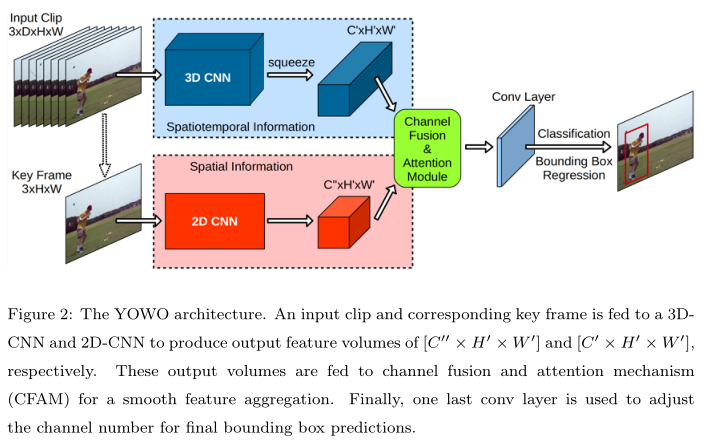
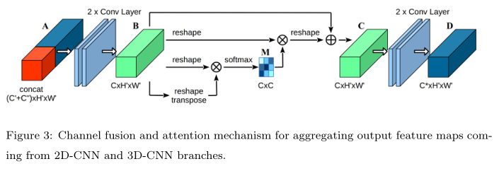
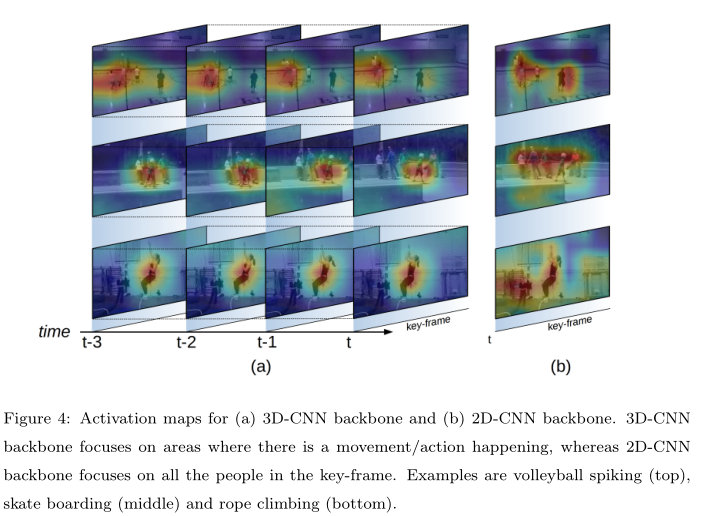

# You Only Watch Once: A Unified CNN architecture for Real-Time Spatiotemporal Action Localization

## 0. Summary

​		主要工作是提出了一个一阶段的方法框架，将YOLO的一阶段框架与2D、3D卷积网络进行结合。后续可以阅读YOLO的改进论文能够有改进YOWO的启发；网络虽然能够达到实时的运行，但是输入clip的长度有所限制，而clip的长度会影响网络的性能。

## 1. Research Objective

​		在视频中的时空间动作定位中，建立一个同时获取时序信息及空间信息的一阶段方法。

## 2. Background and Problems

+ 视频中的时空间动作定位需要同时考虑关键帧的空间信息及历史帧的时序信息，已有方法使用不同的网络分别提取两种信息，再通过融合策略来融合两种信息，以此进行动作检测。检测过程复杂。
+ 受Faster RCNN启发，有很大部分已有方法是基于两阶段网络框架进行设计的，两阶段方法存在一些缺点：、
  1. 两阶段方法对单帧需要产生大量的proposals，当输入为视频时，产生的proposals会大大增加，大大增加计算量。后续的分类需要依赖proposals的生成，减少proposals的数量又会影响分类的性能。
  2. 在分类过程中仅考虑了proposals中的特征，忽略人体与人体及人体与背景之间的关系。
  3. 分别训练RPN网络及分类网络难以获得整体网络的全局最优解，都只能得到局部最优解。
  4. 两阶段方法的训练时间更长，消耗的内存更多。
+ 动作识别也需要融合空间和时序信息:
  + 两阶段方法十分有效，但是大部分都基于optical flow，计算开销大。
  + 将卷积得到的特征通过RNN提取时序信息，但是该类方法性能不足。
  + 3D 卷积越来越多地应用在视频领域中，但是3D 卷积拥有更多地参数，计算更加复杂。
+ ***问题***：时序与空间信息的提取及融合与一阶段网络结构的融合。

## 3. Method

+ 网络架构分为四个部分：3D-CNN分支、2D-CNN分支、CFAM模块及bbox回归网络

  

  1. **3D-CNN 分支**：可使用任意3D卷积网络，输出特征与2D卷积分支的输出特征的维度保持一致。这里默认使用3D-ResNext-101。

     > 保持一致是为了在融合过程中两种特征对结果的贡献保持相同。

  2. **2D-CNN 分支**：可使用任意2D卷积网络，这里默认使用Darknet-19.

  3. **特征融合（Channel Fusion and Attention Mechanism 模块）**：将两种特征按通道进行拼接后进行特征融合：基于格拉姆矩阵的自注意力机制及该模块开头及结尾的各两层卷积。

     

     + 实验发现开头和结尾的卷积操作对CFAM对性能的提升有很大影响。

     > 这里使用2D卷积，由于后续使用通道注意力机制，对同一位置仅对不同通道进行融合，缺少空间上的融合操作，使用卷积能够在空间上对特征进行融合。

  4. **bbox 回归**：与YOLO保持相同，输出特征图中每个位置包含 $[(5\times (NumCls + 5)) \times H' \times W']$ 个输出：

     > 5 anchors * (Number of classes + 4 coordinates of bbox + confidence) * Height * Height

+ 能够为YOWO添加新的输入分支，使其能够使用不同模态的数据，例如optical flow

+ 使用已有的连接策略生成action tube，带了解！

+ **LFB模块**：为了达到实时性，YOWO的输出clip长度有限（16 frames），能够提供的时序信息有限，限制了网络的性能。LFB使用主干网络提取并保存不同时间段的时序信息，并未当前帧提供以其为中心前后一段时间内的时序信息。

  > 这里提供的时序信息包含了关键帧之后的未来时序信息。

## 4. Evalution

+ Setup：使用一块Nvidia Titan GPU，在UCF101-24及J-HMDB-21上进行实验，使用Frame-mAP及Video-mAP作为评价指标。

  > Frame-mAP以帧为单位进行性能评价，Video-mAP需要一个tube中所有帧的平均mIoU超过阈值才将其视为正确预测。

+ 消融实验：

  

  + 2D 卷积网络注重图像中的目标实例，而3D 卷积注重运动过程，关注图像中处于运动的部分。
  + 输入clip中相邻帧的采样间隔增大，网络性能降低。采样间隔会阻碍运动信息的获取。当步长过长时，相同长度的clip的时间跨度会过大，导致个别帧包含与关键帧无关的信息，相当于引入了噪声，影响网络的预测。
  + 使用轻量网络替换3D 卷积分支网络依旧有比较好的性能，看出时序信息对动作识别的重要性。

+ **YOWO存在的不足**：

  + **超前检测**：由于YOWO考虑了关键帧与clip中所有内容之间的关系，有时会在图像中人体还未做出动作时就检测出人体动作。

  + **依赖时序信息**：YOWO十分依赖时序信息，当人体突然做出某个动作时，初始帧缺乏时序信息，难于获得正确的预测。

    > 这里的超前预测是否是使用了LFB模块，为网络提供了未来的时序信息，而依赖时序信息中是否可以使用LFB提供未来的时序信息，来解决该问题？

## 5. Conclusion

+ 提出了同时提取空间及时序信息的一阶段网络，能够进行端到端的训练。
+ 在UCF101-24及J-HMDB-21数据集上超过其他方法，同时达到了实时性能，但是输入clip的长度有所限制。
+ 能够使用轻量网络替换YOWO中的分支，使其能够在移动设备上运行。

## Notes

1. “对于视频中不同帧的预测可能会对同一段视频帧进行重复处理？” 是的，可以看看YOWO的代码实现，比如0到5帧和1到6帧两个queue的输入，其中1到5帧是做了重复计算的，代码上可以优化这一个地方从而提升性能。

2. 我个人认为，CFAM的注意力机制其实和《Non-local Neural Networks》论文中的机制一样。现在也有更多更好的attention机制例如transformer/self-attetion，可以把这些借鉴到这个任务里面。可以参考论文《Is Space-Time Attention All You Need for Video Understanding?》

3. 连接策略中，简单粗暴地使用IOU是否>0作为判断依据，但2D物体检测中一般是用IOU是否>0.5。本文这样判断是否合理？是不是因为这两个数据集里面动作比较稀疏所以可以这样判断？
   另外G-IOU、D-IOU、C-IOU也可以了解一下

4. VIterbi算法、LFB也需要在笔记里介绍一下，可以作为下周的论文阅读

5. 作者没有开源LFB这一块代码，好奇为什么使用预训练模型而不是本文训练的3Dnet模型。如果使用的是LFB论文里的预训练模型，是不是相当于额外引入了AVAA数据集的信息？另外，使用了LFB后的特征是如何输入到CFAM里面的呢

6. 2D检测中测试一般是不卡置信度阈值的，否则会导致mAP降低，可以对比一下其他时空检测论文，或跑一下YOLO代码看看不卡阈值结果会怎样

## References

